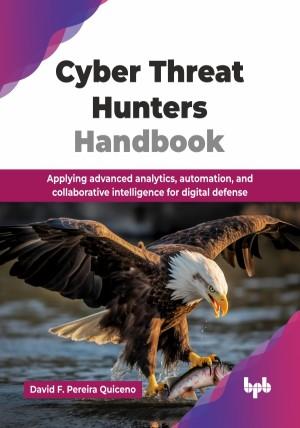

# Cyber Threat Hunters Handbook

Applying advanced analytics, automation, and collaborative intelligence for digital defense.

This is the repository for [Cyber Threat Hunters Handbook
](https://bpbonline.com/products/cyber-threat-hunters-handbook?_pos=1&_sid=49f7601e2&_ss=r&variant=44717014581448?variant=44717014581448),published by BPB Publications.

## About the Book
Cyber threat hunting is the advanced practice that empowers security teams to actively unearth hidden intrusions and subtle attack behaviors that evade traditional tools. Cyber threats are evolving faster than ever. It is used by modern attackers as an advanced technique to infiltrate systems, evade detection, and exploit vulnerabilities at scale. 

This book offers a hands-on, practical approach to threat hunting and covers key topics such as network traffic analysis, operating system compromise detection, malware analysis, APTs, cyber threat intelligence, AI-driven detection techniques, and open-source tools. Each chapter builds the capabilities, from understanding the fundamentals to applying advanced techniques in real-world scenarios. It also covers integrating strategies for dealing with security incidents, outlining crucial methods for effective hunting in various settings, and emphasizing the power of sharing insights.

By the end of this book, readers will possess the critical skills and confidence to effectively identify, analyze, and neutralize advanced cyber threats, significantly elevating their capabilities as cybersecurity professionals.

## What You Will Learn
• Analyze network traffic, logs, and suspicious system behavior.

• Apply threat intelligence and IoCs for early detection.

• Identify and understand malware, APTs, and threat actors.

• Detect and investigate cyber threats using real-world techniques.

• Use techniques and open-source tools for practical threat hunting.

• Strengthen incident response with proactive hunting strategies.
